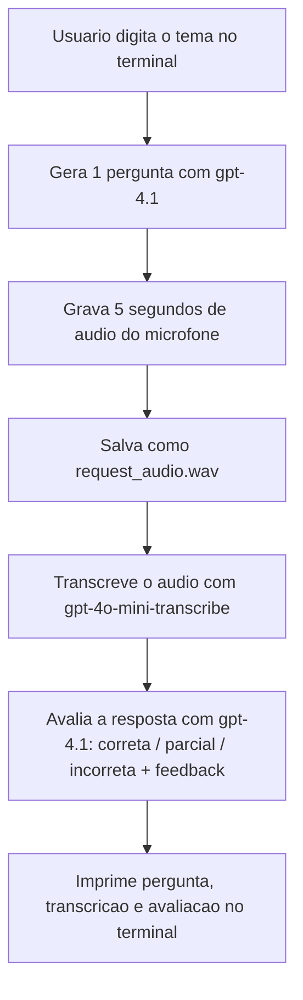

# Quiz Oral de Revisão por Voz com IA

Script de linha de comando que gera uma pergunta de revisão sobre um tema, grava a resposta falada do usuário, transcreve o áudio e avalia a resposta com feedback curto — tudo numa única execução.

**Status:** protótipo funcional de linha de comando — o ciclo completo (pergunta → gravação → transcrição → avaliação) funciona numa única rodada; sem histórico entre execuções, sem testes.

---

## Problema Resolvido

Estudar respondendo em voz alta, e não só escrevendo, ajuda a fixar conteúdo e treina a mesma habilidade que uma prova oral ou entrevista exige. O trabalho manual de montar uma pergunta, gravar a própria resposta, transcrever e julgar se está certa é o que trava esse hábito no dia a dia.

Este projeto automatiza o ciclo inteiro: você digita um tema, a IA gera uma pergunta, você responde falando, e recebe de volta uma classificação (correta, parcial ou incorreta) com um feedback curto, tudo no terminal.

---

## Como Funciona



---

## Arquitetura

- **`main.py`** — orquestra o fluxo do início ao fim; não tem lógica própria além de encadear as chamadas aos outros módulos.
- **`quiz_engine.py`** — gera a pergunta a partir do tema informado.
- **`audio_recorder.py`** — grava um trecho fixo de 5 segundos do microfone padrão e salva em `.wav`.
- **`transcriber.py`** — envia o `.wav` para a API de transcrição da OpenAI e devolve o texto.
- **`evaluator.py`** — envia tema, pergunta e resposta transcrita para o modelo, que classifica a resposta e devolve um feedback curto.

---

## Decisões de Arquitetura

**Um módulo por responsabilidade** — mesmo sendo um script pequeno, separar gravação, transcrição, geração de pergunta e avaliação em arquivos diferentes deixa fácil trocar qualquer peça (por exemplo, outra lib de captura de áudio) sem mexer no resto.

**Responses API da OpenAI para os dois pontos que só lidam com texto** (gerar pergunta e avaliar resposta), **e a API de transcrição separada só onde o input é áudio** — mantém claro, olhando o código, qual chamada faz o quê.

**Gravação com duração fixa (5 segundos), sem detecção de silêncio** — mais simples de implementar do que decidir programaticamente quando o usuário parou de falar. O custo dessa escolha está nos trade-offs.

**Chave da OpenAI via variável de ambiente do sistema, sem `.env`** — para o tamanho do projeto, bastou instruir a pessoa a exportar `OPENAI_API_KEY` na sessão do terminal antes de rodar.

---

## Trade-offs

**Gravação de duração fixa em 5 segundos.** Simples de implementar, mas corta respostas mais longas e grava (e manda pra transcrição) silêncio "morto" se a resposta for mais curta. Não há contagem regressiva antes de começar: o `print("OUVINDO...")` aparece exatamente quando a gravação já está em andamento.

**Uma pergunta por execução, sem loop.** Cada rodada do programa cobre um ciclo completo (tema → pergunta → resposta → avaliação) e termina. Pra treinar outro tema ou repetir, é preciso rodar `python main.py` de novo.

**Nome de arquivo de áudio fixo (`request_audio.wav`).** Cada execução sobrescreve o áudio da execução anterior — não sobra um histórico de respostas gravadas.

---

## Estrutura do Projeto

```text
voice-review-quiz-ai/
├── main.py              # orquestra: tema -> pergunta -> gravação -> transcrição -> avaliação
├── quiz_engine.py        # gera a pergunta a partir do tema
├── audio_recorder.py     # grava 5s de áudio do microfone
├── transcriber.py        # transcreve o áudio gravado
└── evaluator.py          # avalia a resposta transcrita
```

---

## Tecnologias

| Tecnologia | Papel no projeto |
|---|---|
| OpenAI — Responses API | Gera a pergunta e avalia a resposta |
| OpenAI — Audio Transcriptions | Transcreve o áudio gravado |
| sounddevice | Captura áudio do microfone padrão |
| soundfile | Salva o áudio capturado em `.wav` |

Não há `requirements.txt` neste repositório — as dependências estão documentadas só como comando de instalação.

---

## Como Executar

```bash
pip install openai sounddevice soundfile
```

Defina a chave da OpenAI como variável de ambiente:

```powershell
$env:OPENAI_API_KEY="sua_chave_aqui"
```

```bash
# Linux/Mac
export OPENAI_API_KEY="sua_chave_aqui"
```

Rode:

```bash
python main.py
```

Digite o tema quando pedido, responda em voz alta durante os 5 segundos de gravação e veja a avaliação impressa no terminal.

---

## Como Testar

Não há testes automatizados. A validação é rodar o programa e observar três pontos: a pergunta gerada faz sentido com o tema pedido; a transcrição bate com o que foi falado; a classificação (correta/parcial/incorreta) é coerente com a resposta dada.

---

## Limitações Conhecidas

- Gravação de duração fixa (5s), sem detecção de silêncio nem contagem regressiva antes de começar.
- Uma pergunta por execução — não há loop de múltiplas perguntas na mesma sessão.
- O parâmetro `level` de `generate_question` sempre usa o valor padrão `"facil"`; não há como escolher outro nível pela CLI.
- Nome de arquivo de áudio fixo (`request_audio.wav`), sobrescrito a cada execução.
- Sem `.gitignore`: os arquivos compilados de `__pycache__` foram commitados junto com o código.
- Sem `requirements.txt`.
- Sem tratamento de erro próprio se `OPENAI_API_KEY` não estiver definida ou o microfone padrão não existir — o erro exibido é o da própria biblioteca.

---

## O que este projeto ainda NÃO faz

- Não guarda histórico de perguntas, respostas ou pontuação entre execuções.
- Não permite escolher nível de dificuldade nem quantidade de perguntas por sessão.
- Não valida se a gravação captou áudio de fato (ex.: microfone silenciado).
- Não tem testes automatizados nem CI/CD.
- Não tem interface além do terminal.

---

## Próximos Passos

- Adicionar um loop de múltiplas perguntas por tema, com pontuação acumulada ao final.
- Expor o nível de dificuldade (`level`) como pergunta ao usuário na CLI.
- Detectar silêncio para encerrar a gravação antes do tempo fixo, ou ao menos avisar com uma contagem regressiva antes de começar a gravar.
- Criar `requirements.txt` e adicionar um `.gitignore` (removendo o `__pycache__` já commitado).
- Salvar um histórico simples (JSON ou CSV) de perguntas, respostas e avaliações por sessão.

---

## Evolução para Produção

- **Interface web** simples, no lugar do terminal, para tornar o uso mais acessível.
- **Persistência de histórico e progresso** do usuário, num banco leve.
- **Configuração via `.env`/`python-dotenv`**, no lugar de depender de variável de ambiente exportada manualmente.
- **Testes automatizados** para a lógica determinística (montagem de prompt, fluxo de `main.py`), com mocks para as chamadas à OpenAI.
- **Empacotamento como CLI** (`argparse`/`typer`) ou pacote instalável, no lugar de rodar `main.py` diretamente.

---

## Aprendizados

A maior dificuldade foi decidir a duração da gravação: um valor fixo simplifica bastante o código, mas usando o programa fica claro que 5 segundos tanto pode cortar uma resposta mais longa quanto sobrar silêncio numa resposta curta.

Só percebi nesta revisão que o `__pycache__` foi parar no repositório — ainda não tinha criado um `.gitignore`, e é o tipo de coisa fácil de esquecer num projeto pequeno feito rápido.

Separar gravação, transcrição, geração de pergunta e avaliação em arquivos diferentes, mesmo num script pequeno, deixou bem mais fácil testar cada parte isoladamente enquanto eu escrevia o projeto.

Usar a Responses API da OpenAI nos dois pontos que só lidam com texto, e a API de transcrição só no áudio, deixou claro na cabeça qual chamada faz o quê.

---

## Autor

**Robert Emanuel**

Desenvolvedor Back-end focado em Python, FastAPI, SQL, Docker e APIs REST.

GitHub:
https://github.com/r0b3rTdk

LinkedIn:
https://www.linkedin.com/in/robert-emanuel/
